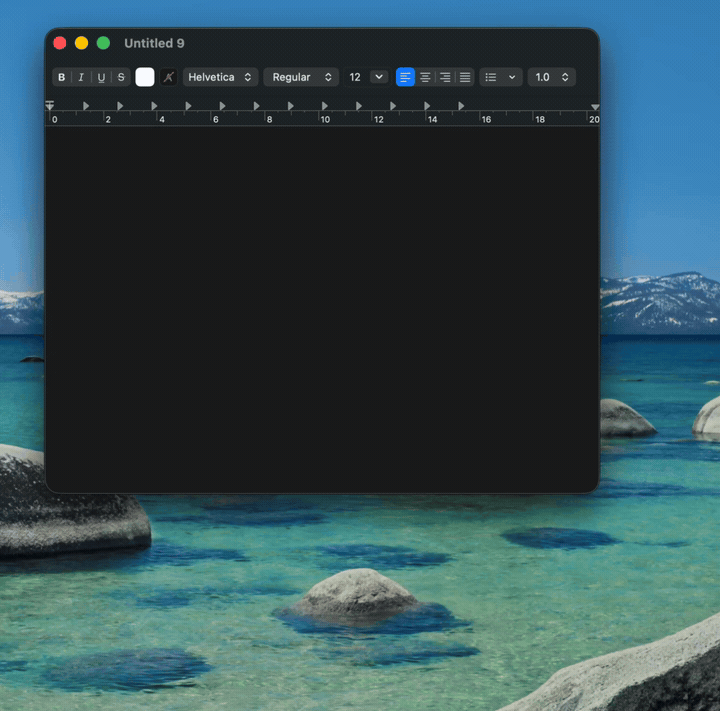

# local-dictation

**Hold a hotkey, speak, release — cleaned text appears at your cursor.** A local-first dictation app for Apple Silicon, optimized for the lowest latency and highest accuracy I could get end-to-end. Everything runs on-device; nothing touches the network at runtime.


<!--
DEMO GIF GOES HERE. Record a ~5–8 s screen capture and save it to docs/demo.gif, then
replace this comment with:  

What to show, in one take:
  1. Cursor sitting in a real app (Notes / a code editor / Slack).
  2. Press & hold Right Option — the dark waveform pill appears at the bottom of the screen
     and the menu-bar icon flips to recording.
  3. Say a sentence with a filler word or two ("um, so the meeting is, like, at three").
  4. Release — the cleaned sentence lands at the cursor (fillers gone, punctuation right).
  5. Optional second beat: select that text, hold Shift+Right Option, say "make this more
     concise", release — watch it rewrite in place.

Capture tips: record the full screen at retina, 30 FPS; trim dead air; keep it under ~6 MB so
it loads fast on GitHub. `gifski` or QuickTime → ffmpeg both work. The whole point is that a
visitor *sees* the value in 5 seconds without reading a word — so lead the file with it.
-->

> **Heads-up:** this is a personal tool I built for my own daily driving on an Apple Silicon Mac, shared openly in case it's useful to you. It's not a packaged product — there's no signed installer, you build it from source, and it's tuned to how *I* dictate. If that fits, you'll probably like it; if you want a one-click app, see the alternatives below.

## Why this instead of …

There are good dictation tools already. This one exists because I wanted a specific combination the others don't quite hit: **fully on-device, sub-400 ms, and hackable down to the system prompt.**

| | local-dictation | Built-in macOS dictation | Cloud tools (e.g. Wispr Flow) | Local apps (e.g. superwhisper, MacWhisper) |
| --- | --- | --- | --- | --- |
| Runs fully on-device | ✅ | ✅ | ❌ (audio leaves your Mac) | ✅ |
| End-to-end latency | ~300–400 ms (2 s clip) | variable | network-bound | varies |
| LLM cleanup of fillers/punctuation | ✅ (Gemma, on-device) | ❌ | ✅ | some |
| Edit *selected* text by voice | ✅ | ❌ | partial | rare |
| Editable system prompts | ✅ (plain JSON) | ❌ | ❌ | ❌ |
| Open source, free | ✅ MIT/Apache | n/a | ❌ | mostly ❌ |
| Polished, one-click install | ❌ (build from source) | ✅ | ✅ | ✅ |

*(Competitor capabilities as I understood them at the time of writing — check their current versions.)* The short version: if you want zero setup and a maintained app, the others win. If you want every millisecond and the ability to rewrite the model's behaviour by editing a text file, that's this.

## Get started

The fastest path by hand (≈ a couple minutes plus model download):

```bash
# Toolchain (one-time)
rustup update stable
xcode-select --install
brew install cmake

# Get the code + models
git clone https://github.com/tristan-mcinnis/local-dictation
cd local-dictation
./scripts/download-models.sh

# Build (release, full feature set)
cargo build --features full --release

# Run
./target/release/fast-dictate-backend daemon
```

First daemon run prompts for **Microphone** and **Accessibility** permissions. Grant both in System Settings → Privacy & Security, then re-run.

### Install it as a real Mac app

Prefer a double-click app over a terminal command? Build `Local Dictation.app` and drop it in your Applications folder:

```bash
./scripts/build-app.sh --install
```

That builds the app, copies it to `/Applications`, sets it to **launch automatically at login**, and starts it. It runs as a **menu-bar app** (no Dock icon) — look for the 🎤 in your menu bar. Grant **Microphone** and **Accessibility** once when macOS asks; because it's a stable signed app bundle, the permissions stick to the app instead of to a terminal window.

```bash
./scripts/build-app.sh                  # just build it into ./dist (no install)
./scripts/build-app.sh --bundle-models  # self-contained ~1.4 GB app (for sharing/moving)
```

By default the app shares the models in `./models` (so rebuilds are instant during development); `--bundle-models` copies the recommended Parakeet + Gemma stack inside the app so it works anywhere.

### …or hand it to an AI agent

Don't want to think about toolchains, where the model files go, or which build flags to pass? Paste the prompt below into a coding agent running on your Mac — **Claude Code**, **Codex**, **Cursor**, whatever you use. It reads this README, installs the prerequisites, downloads the models, and builds the release binary — then walks you through the one step it *can't* do for you (granting macOS permissions and launching the daemon).

```text
Set up the "local-dictation" app on this Mac (Apple Silicon) from
https://github.com/tristan-mcinnis/local-dictation. Read the repo's README,
then do the setup for me:
1. Install any missing prerequisites: Rust (via rustup), the Xcode Command
   Line Tools, and cmake (via Homebrew).
2. Clone the repo (or just use it if we're already inside it).
3. Run ./scripts/download-models.sh — it downloads the Parakeet (speech-to-text)
   and Gemma (cleanup) models into ./models/, which is exactly where the app
   looks for them. Don't move them.
4. Build the release binary:  cargo build --features full --release
Then STOP and give me plain copy-paste instructions for the steps you CAN'T do
yourself: I have to launch the daemon from MY OWN terminal with
  ./target/release/fast-dictate-backend daemon
and grant Microphone + Accessibility permission in System Settings the first
time it runs. macOS ties Accessibility permission to the terminal that launches
the process, so you can't start it for me — that part is on me.
Finally, remind me of the hotkeys: hold Right Option to dictate; for hands-free,
hold Right Option and tap Space, let go of both, keep talking, then tap Right
Option once to stop.
```

## How you use it

With the daemon running (`./target/release/fast-dictate-backend daemon`), **hold Right Option**, speak, release. The cleaned text gets injected wherever your cursor is.

Long thought, or just don't want to hold the key? Use **hands-free mode**: hold Right Option and **tap Space** (a short *pop* confirms), then **let go of both keys and keep talking**. Tap Right Option once more to stop. Recording keeps running with nothing held down.

While you talk, a small dark pill floats at the bottom of your cursor's screen with a **live waveform** driven by your mic — bars rise instantly on each syllable and decay slowly so peaks are visible:

```
        ╭─────────────────────────╮
        │   ▎▍▆█▇▅▎▏ ▍▆▇▄▎       │   ← live mic, ~30 FPS
        ╰─────────────────────────╯
```

A small **menu-bar icon** mirrors the state: 🎤 idle · 🔴 recording · ⏳ processing. Subtle audio cues (Tink on start, Bottle on stop) confirm key transitions without being noisy.

## Transform selected text by voice

Beyond dictating new text, you can **edit text you've already got** by voice. Select a passage, then hold **Shift + Right Option** (Shift first, then the push-to-talk key), speak an instruction, and release. The selection is read, rewritten by the same warm Gemma model, and pasted back in place — works even in Electron/terminal apps, because the read + write both go through the clipboard.

```
select text → hold Shift+Right Option → say "make this more concise" → release
```

Things that work well with the default (1B) model: rephrasing, tightening or expanding, changing tone, fixing grammar, reformatting (e.g. "turn this into bullet points"), and translation ("translate to Spanish").

**It comes down to the prompt.** The model only sees your spoken instruction plus the selected text, wrapped in a *system prompt*. The built-in transform prompt is deliberately permissive — it follows your instruction even when that means *adding* content, so "turn these two bullets into four" actually expands rather than playing it safe. If a transform under- or over-does it, that prompt is the dial to turn (see [Editable prompts](#editable-prompts)). Keep in mind it's a 1B model: small, fast, and occasionally literal — short selections give it little to work with, so expansion instructions land better when there's some substance to build on.

### Editable prompts

The two system prompts — **transform** (above) and **cleanup** (the always-on dictation tidy-up) — are editable. The quickest way in is the menu bar: **Edit cleanup prompts…** opens `~/.config/local-dictation/prompts.json` in your text editor, creating it the first time pre-filled with the currently-active prompts and inline notes — so you start from working text, not a blank file. (Prefer to do it by hand? Copy [`prompts.example.json`](./prompts.example.json) to that path instead.) Both fields are optional, and a blank string falls back to the built-in default, so a partial file is fine.

```jsonc
// ~/.config/local-dictation/prompts.json
{
  "transform": "Rewrite the selected text exactly as I instruct. ...",
  "cleanup":   "Clean up this dictation for readability. ..."
}
```

Prompts are read once when the daemon starts, so **edit, then relaunch** to test a change. The boot log prints `prompts cleanup=… · transform=…` (`default` or `custom`) so you can confirm your file took effect. Precedence is **env var > `prompts.json` > built-in default** — set `DICTATE_TRANSFORM_PROMPT` / `DICTATE_CLEANUP_PROMPT` for a one-off scripted experiment, or `DICTATE_PROMPTS_PATH` to point at a different file.

## Verified performance

Measured on Apple Silicon, hot path after warm-up, end-to-end from key release to text injected:

| Speech length | Total latency |
| --- | --- |
| 2 s utterance | ~300–400 ms |
| 5 s utterance | ~500–700 ms |
| 10 s utterance | ~800 ms–1.1 s |

Breakdown of a typical 2 s utterance:

```
transcribe (Parakeet TDT v3 INT8, CoreML)    ~90 ms
cleanup    (Gemma 3 1B Q4_K_M, Metal)       ~150 ms
inject     (AX direct, native apps)           ~5 ms
                                            ────────
                                             ~245 ms
```

Inject is ~185 ms for Electron-class apps (VS Code, Slack, Discord, browsers, Notion, Obsidian, Zed, Figma — anything with a renderer process that swallows AX writes). For those we route through clipboard paste, which always works.

## Models

Both fully local. A helper script downloads the two defaults:

```bash
./scripts/download-models.sh
```

| Model | Size | Role |
| --- | --- | --- |
| Parakeet TDT v3 INT8 (ONNX) | 640 MB | ASR — speech → text |
| Gemma 3 1B-IT Q4_K_M (GGUF) | 770 MB | Cleanup — strip fillers, fix punctuation, preserve domain casing |

### Why Gemma 3 1B is the default cleanup model

Five GGUF cleanup models were tried on conversational English dictation. The
job is small — drop fillers, fix punctuation/casing, expand `gonna → going to`
— so the question was the smallest model that does it *without* mangling
meaning or domain casing. Sizes are Q4_K_M on disk; latency is hot-path
cleanup of a ~2 s utterance on Apple Silicon (Metal).

| Model | Size | Cleanup latency | Quality on dictation | Verdict |
| --- | --- | --- | --- | --- |
| **Gemma 3 1B-IT** | 770 MB | **~150 ms** | Matches 4B on everyday speech; keeps `macOS`/`Rust`/`GitHub` casing | **Default** — best quality-per-ms |
| Gemma 3 4B-IT | 2.5 GB | ~3× slower (~450 ms) | Marginally better on long/complex sentences | Use for max polish if you don't mind the latency |
| Llama 3.2 1B-IT | 808 MB | ~1B-class | Solid, but slightly looser on punctuation than Gemma 1B | Fine alternative; no clear win over the default |
| Qwen 2.5 0.5B-IT | 398 MB | Fastest of the usable set | Quicker, but drops the occasional word and over-trims | Pick for raw speed on a slow machine |
| SmolLM2 360M-IT | 271 MB | Fastest overall | Too aggressive — rewrites/omits content | Not recommended for cleanup |

The takeaway: **4B isn't worth ~3× the latency for everyday dictation, and the
sub-1B models start trading away accuracy.** Gemma 3 1B sits at the knee of the
curve, so it ships as the default.

You don't have to edit anything to switch — pick a different model from the
**menu bar** (see below), or set `GEMMA_MODEL_PATH` for a scripted launch. The
download script fetches only Parakeet + Gemma 3 1B; the other four are optional
and can be downloaded into `models/llm/<name>/` to appear in the picker.

## Features

- **Push-to-talk.** Hold Right Option (configurable via `DICTATE_HOTKEY_KEYCODE`), speak, release.
- **Hands-free mode.** Hold the push-to-talk key and **tap Space** to latch (a *pop* cue confirms), then release both keys and keep talking — recording continues with nothing held. **Tap the push-to-talk key once** to stop and inject. Normal hold-to-talk is unchanged; the latch only engages when you chord Space during a hold. (Space is swallowed while you hold the key, so it never leaks a character into your text.)
- **Live waveform pill.** Floating dark pill at the bottom of your cursor's screen with 14 vertical bars driven by real-time mic RMS. Noise-gated so it stays still during ambient room sound; peak-hold + decay so loud syllables visibly linger before falling.
- **Menu-bar icon + settings (SF Symbol).** Native macOS look that adopts your menu-bar tint: `mic` (idle) → `mic.fill` (recording) → `waveform` (processing). Click it for a full menu — no env vars or relaunch scripts needed:
  - **Last dictation preview** + **Copy last dictation** (⌘C) — grab what you just dictated.
  - **Dictation History…** (⌘H) — opens a small native window listing past dictations, newest first, grouped by day. The friendly counterpart to the log: just the text and when, nothing else.
  - **Cleanup model ▸** — checkable submenu of every model under `models/llm/`; pick one and the daemon relaunches on it.
  - **Push-to-talk key ▸** — Right Option / Command / Control / Shift.
  - **Cleanup enabled** — toggle LLM cleanup on/off (raw transcript when off).
  - **Edit cleanup prompts…** — opens `prompts.json` in your text editor, seeded the first time with the currently-active cleanup + transform system prompts (with inline notes) so there's real text to edit. Save, then relaunch (e.g. toggle Cleanup enabled off/on) to apply. See [Editable prompts](#editable-prompts).
  - **Open Log** (⌘L), **Export Log to Downloads…**, **Open corrections folder**.
  - **Quit** (⌘Q).
  Settings persist to `~/.config/local-dictation/settings.json`. Changing the model, hotkey, or cleanup toggle relaunches the daemon to apply (the model is loaded once at boot, so a relaunch is cleaner than a live swap). Any env var override (`GEMMA_MODEL_PATH`, `DICTATE_HOTKEY_KEYCODE`) wins over the menu and greys out the matching items.
- **Audio cues.** Tink on start, Bottle on stop, Pop on hands-free latch, Basso on error. Mute with `DICTATE_QUIET=1`.
- **Smart spacing & capitalization.** Reads the focused element's caret context (or remembers the last-injected character when AX doesn't expose it) so consecutive dictations get the right spacing — no `wordswithoutspaces`, no `lowercase after a period`.
- **Cleanup that respects your voice.** Removes `uh / um / like / you know`, expands colloquial contractions (`wanna → want to`, `gonna → going to`, `kinda → kind of`), keeps standard contractions (`don't`, `it's`), and preserves domain casing (`macOS`, `Rust`, `ONNX`, `GitHub`).
- **Transform selected text by voice.** Select text, hold **Shift + Right Option**, speak an instruction ("make this concise", "turn into bullet points", "translate to Spanish"), release — the selection is rewritten in place via the warm Gemma model. See [Transform selected text by voice](#transform-selected-text-by-voice).
- **Editable prompts.** The transform and cleanup system prompts live in `~/.config/local-dictation/prompts.json` (copy [`prompts.example.json`](./prompts.example.json)); tune how the model behaves without touching code. See [Editable prompts](#editable-prompts).
- **Clipboard fallback for Electron.** VS Code, Slack, Discord, browsers, etc. silently accept AX writes without rendering them — for those, we use save-clipboard → Cmd+V → restore.
- **Personal corrections dictionary.** Drop a JSON file at `~/.config/local-dictation/corrections.json` mapping words you commonly mis-transcribe to their right form (`{"lings": "Lingzi", "github": "GitHub"}`). Applied after cleanup, before injection. Case-insensitive match at word boundaries; replacement is verbatim. See `corrections.example.json`.
- **Inline voice commands.** End a dictation with a recognised phrase and it's stripped from the text and turned into a keystroke after the body is injected: `press enter` / `press return` / `hit enter` / `new line` → **Return**; `new paragraph` → **two Returns**; `press tab` / `hit tab` → **Tab**. And if the *whole* utterance is `scratch that` / `never mind` / `cancel that` / `delete that`, nothing is injected. All matched on word boundaries, so "compress enter" or "let me scratch that itch" never fire.
- **Dictation history.** Every injected dictation is saved to a tiny SQLite database at `~/.config/local-dictation/history.db`. Open **Dictation History…** from the menu bar for a plain native window listing them newest-first, grouped by day — readable at a glance, unlike the timing-heavy log.
- **Structured logs.** Aligned per-utterance blocks at `/tmp/dictate-daemon.log` showing transcribe / cleanup / inject timings, the target app name, and the final injected text.

## What the log looks like

`/tmp/dictate-daemon.log` after a couple of utterances:

```
[boot] parakeet    loaded in  757 ms
[boot] cleaner     loaded in  360 ms · gemma-3-1b-it-Q4_K_M.gguf
[boot] warm-up     done   in  374 ms
[boot] ready · hold Right Option (0x3d) to dictate · Right Option+Space then release = hands-free (tap Right Option to stop) · ⌘Q quits

▶ recording
⏹ stopped · held 2.16s
  xcr   142 ms · cln  305 ms · inj  183 ms
  app  Visual Studio Code (pid 82458)
  ✓    "How do these things are they showing up better?"

▶ recording
⏹ stopped · held 0.89s
  skip · empty transcript
```

`xcr` = transcribe (Parakeet), `cln` = cleanup (Gemma), `inj` = inject (AX or clipboard). `app` is the resolved name of whatever process owned the focused UI element. Tail it live with `tail -f /tmp/dictate-daemon.log`.

## Subcommands

| Command | What it does |
| --- | --- |
| `daemon` | Push-to-talk daemon — the way to use this for real |
| `logs` | Open `/tmp/dictate-daemon.log` in your default editor |
| `bench [wav]` | Transcribe + clean a WAV, report timings |
| `dictate <ms>` | Fixed-duration capture (no hotkey) |
| `inject-test [text]` | AX-only smoke test |
| `ax-check` | Surface the Accessibility permission prompt |

## Settings & environment knobs

Two ways to configure the daemon, in order of precedence:

1. **Env vars** (below) — win over everything; best for scripted launches.
2. **`~/.config/local-dictation/settings.json`** — written by the menu bar; holds `gemma_model`, `hotkey_keycode`, `cleanup_enabled`. You rarely edit it by hand.
   - **`~/.config/local-dictation/prompts.json`** (separate, hand-edited) — the transform + cleanup system prompts. See [Editable prompts](#editable-prompts).
3. **Built-in defaults.**

| Var | Effect |
| --- | --- |
| `PARAKEET_MODEL_DIR` | Default: `models/dictation/parakeet-tdt-v3-int8` |
| `GEMMA_MODEL_PATH` | Cleanup model. Default: `models/llm/gemma-3-1b-it/gemma-3-1b-it-Q4_K_M.gguf`. Overrides the menu's model picker. |
| `DICTATE_HOTKEY_KEYCODE` | Default: `0x3D` (Right Option). Also handled: `0x36` Right ⌘, `0x3E` Right Control, `0x3C` Right Shift. The daemon watches the matching modifier flag, so any of these register a hold correctly. Overrides the menu's key picker. |
| `DICTATE_QUIET` | Set to anything to mute audio cues |
| `FOCUS_APP` | Activate a specific app and inject by PID (for scripted tests) |
| `INJECT_DIAG` | Log focused element role + PID before every inject |
| `DICTATE_CORRECTIONS_PATH` | Override the corrections JSON path (default: `~/.config/local-dictation/corrections.json`) |
| `DICTATE_PROMPTS_PATH` | Override the prompts JSON path (default: `~/.config/local-dictation/prompts.json`) |
| `DICTATE_TRANSFORM_PROMPT` | Inline override for the transform system prompt (wins over `prompts.json`) |
| `DICTATE_CLEANUP_PROMPT` | Inline override for the cleanup system prompt (wins over `prompts.json`) |

## Trade-offs (the honest list)

- **English-first.** Parakeet TDT v3 supports multilingual but the cleanup prompt + model are tuned for English.
- **~300 ms minimum cleanup latency.** Skip it with the `--no-cleanup` flag if you want the raw ~150 ms transcribe-only path.
- **Electron apps cost ~185 ms** (clipboard paste settle time). Native Cocoa apps inject in ~5 ms.
- **No voice activity detection.** Recording is bounded by key hold time, not silence.
- **Plain-text-only clipboard restore.** RTF / images / file URLs on your clipboard at inject time are lost (only matters when the Electron fallback fires).
- **macOS-only.** cpal + AX + Metal + CoreML are all macOS-specific. Linux/Windows ports would need different runtime + injection layers.

## Project layout

```
src/
├── audio.rs            cpal input + SPSC ring buffer + drain_until_stopped
├── cleaner.rs          Gemma cleanup (llama-cpp-2 + Metal)
├── clipboard_paste.rs  save → set → Cmd+V → restore (+ Return key synth)
├── cues.rs             afplay system sounds
├── daemon.rs           push-to-talk loop, CGEventTap, worker thread
├── history.rs          SQLite dictation history (record / recent)
├── injector.rs         AX direct + smart-spacing + Electron clipboard route
├── menubar.rs          NSStatusItem menu (model/hotkey/cleanup/history) + pill + history window
├── prompts.rs          editable transform + cleanup system prompts (prompts.json)
├── refiner.rs          corrections + voice-command parse (shared by daemon & CLI)
├── settings.rs         ~/.config/local-dictation/settings.json load/save
├── smart_pad.rs        spacing & capitalization rules
├── text_polish.rs      strip LLM preamble / quotes / artefacts
├── transcriber.rs      Parakeet wrapper + WAV loader
├── ui_channel.rs       worker→UI state / last-dictation / audio levels
└── voice_commands.rs   trailing "press enter" detection
tests/verification.rs   ring buffer + drain integration tests
```

## Tests

```bash
cargo test                # 61 unit + 2 integration, no models needed
cargo test --features full  # adds the menubar/history/injector/cleaner + hotkey suites — 74 total
```

## License

Dual-licensed under MIT OR Apache-2.0, at your option. See [LICENSE-MIT](./LICENSE-MIT) and [LICENSE-APACHE](./LICENSE-APACHE).

Models are not redistributed by this repo. Parakeet TDT v3 is © NVIDIA under their license; Gemma 3 is under Google's Gemma terms. Check each model's repo before commercial use.
