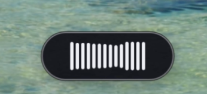

# local-dictation — free, private, on-device dictation for macOS

**The fastest, lowest-latency, fully on-device dictation app for Apple Silicon.** Hold a hotkey, speak, release — cleaned text appears at your cursor in **~300–400 ms end-to-end** (key release → injected text, 2 s clip). Speech is transcribed, LLM-cleaned, and injected entirely on-device; **nothing touches the network at runtime.** No cloud, no streaming, no round-trip — just local compute on the Apple Neural Engine + Metal.

*A free, open-source, **offline speech-to-text / voice-to-text** tool for macOS — a private, local **alternative to cloud dictation and Whisper-based apps**. Push-to-talk dictation with on-device LLM cleanup (filler removal, punctuation, domain casing) and voice editing of selected text. Runs 100% locally on Apple Silicon (M1/M2/M3/M4) — your audio never leaves your Mac.*


### ⚡ Latency at a glance

Measured on Apple Silicon, hot path after warm-up, **end-to-end from key release to text on screen** — transcription **and** LLM cleanup included:

| Speech length | Total latency | What's happening |
| --- | --- | --- |
| **2 s utterance** | **~300–400 ms** | transcribe ~90 ms · clean ~150 ms · inject ~5 ms |
| 5 s utterance | ~500–700 ms | scales with audio length, not network |
| 10 s utterance | ~800 ms–1.1 s | still fully local, still no round-trip |

Two small on-device models do the work: **Parakeet TDT v3** (ASR, CoreML on the Neural Engine) → **Qwen 2.5 1.5B** (cleanup, llama.cpp + Metal). The ~400-token cleanup prompt is decoded once at boot and its KV-cache prefix reused every utterance, so cleanup stays near ~140 ms instead of re-prefilling each time. Full breakdown and methodology in [Verified performance](#verified-performance) below.

<p align="center">
  
</p>

> **Heads-up:** this is a personal tool I built for my own daily driving on an Apple Silicon Mac, shared openly in case it's useful to you. There's a prebuilt `.dmg` you can download, but it's only **ad-hoc signed** (no paid Apple Developer ID), so macOS needs a one-time Gatekeeper override — and the whole thing is tuned to how *I* dictate. If that fits, you'll probably like it; if you want a polished one-click app, see the alternatives below.

## Why this instead of …

There are good dictation tools already. This one exists because I wanted a specific combination the others don't quite hit: **fully on-device, sub-400 ms, and hackable down to the system prompt.**

| | local-dictation | Built-in macOS dictation | Cloud tools (e.g. Wispr Flow) | Local apps (e.g. superwhisper, MacWhisper) |
| --- | --- | --- | --- | --- |
| Runs fully on-device | ✅ | ✅ | ❌ (audio leaves your Mac) | ✅ |
| End-to-end latency | ~300–400 ms (2 s clip) | variable | network-bound | varies |
| LLM cleanup of fillers/punctuation | ✅ (Qwen 2.5 1.5B, on-device) | ❌ | ✅ | some |
| Edit *selected* text by voice | ✅ | ❌ | partial | rare |
| Editable system prompts | ✅ (plain JSON) | ❌ | ❌ | ❌ |
| Open source, free | ✅ MIT/Apache | n/a | ❌ | mostly ❌ |
| Polished, one-click install | ❌ (build from source) | ✅ | ✅ | ✅ |

*(Competitor capabilities as I understood them at the time of writing — check their current versions.)* The short version: if you want zero setup and a maintained app, the others win. If you want every millisecond and the ability to rewrite the model's behaviour by editing a text file, that's this.

## Get started

**Easiest — download the app.** Grab **Local Dictation.dmg** from the [latest release](https://github.com/tristan-mcinnis/local-dictation/releases/latest), open it, and drag **Local Dictation.app** into `/Applications`. It's a self-contained ~1.7 GB bundle (Parakeet + Qwen 2.5 1.5B included), so there's no toolchain to install. Because it's ad-hoc signed, Gatekeeper blocks it on first open — clear the quarantine flag once:

```bash
xattr -dr com.apple.quarantine "/Applications/Local Dictation.app"
```

Then launch it, grant **Microphone** + **Accessibility** in System Settings → Privacy & Security, and look for the 🎤 in your menu bar.

**Build from source — one script.** Clone the repo and run the installer:

```bash
git clone https://github.com/tristan-mcinnis/local-dictation
cd local-dictation
./install.sh
```

`install.sh` checks your prerequisites (installing Rust / cmake for you if you say yes), downloads the models, builds the app, drops **Local Dictation.app** into `/Applications`, sets it to **launch at login**, and starts it. It's safe to re-run. The only thing it can't do for you is grant macOS permissions — the first launch asks for **Microphone** and **Accessibility**; grant both in System Settings → Privacy & Security. Look for the 🎤 in your menu bar.

> Heads-up: the app is ad-hoc signed (no paid Apple Developer ID), so after you *rebuild* it macOS may occasionally re-ask for those two permissions. A few seconds in System Settings — that's the only catch.

<details>
<summary><b>The manual way</b> (run the daemon from a terminal, or build the app yourself)</summary>

```bash
# Toolchain (one-time)
rustup update stable
xcode-select --install
brew install cmake

# Get the code + models
git clone https://github.com/tristan-mcinnis/local-dictation
cd local-dictation
./scripts/download-models.sh

# Build (release, full feature set)
cargo build --features full --release

# Either: run the daemon straight from the terminal …
./target/release/fast-dictate-backend daemon

# … or build the .app bundle yourself:
./scripts/build-app.sh                  # build into ./dist (no install)
./scripts/build-app.sh --install        # + copy to /Applications, login item, launch
./scripts/build-app.sh --bundle-models  # self-contained ~1.4 GB app (for sharing/moving)
```

Running the daemon directly from a terminal prompts for Microphone + Accessibility tied to *that terminal*; the `.app` is the cleaner path because the permissions attach to the app itself. By default the app shares the models in `./models` (instant rebuilds during development); `--bundle-models` copies the recommended Parakeet + Qwen 2.5 1.5B stack inside the app so it works anywhere.

</details>

<details>
<summary><b>…or hand it to an AI agent</b> (paste this into Claude Code / Codex / Cursor)</summary>

Don't want to touch a terminal at all? Paste the prompt below into a coding agent running on your Mac. It clones the repo and runs the installer for you, then walks you through the one step it *can't* do (granting macOS permissions).

```text
Set up the "local-dictation" app on this Mac (Apple Silicon) from
https://github.com/tristan-mcinnis/local-dictation:
1. Clone the repo (or use it if we're already inside it).
2. Run ./install.sh — it checks prerequisites, downloads the models, builds
   "Local Dictation.app", installs it to /Applications, and sets it to launch
   at login. Answer "yes" to any prompts about installing Rust or cmake.
Then STOP and tell me the one thing you can't do for me: on first launch macOS
asks for Microphone + Accessibility permission, and I have to grant both in
System Settings → Privacy & Security myself (you can't grant them for me).
Finally, remind me of the hotkeys: hold Right Option to dictate; for hands-free,
hold Right Option and tap Space, let go of both, keep talking, then tap Right
Option once to stop.
```

</details>

## How you use it

With the daemon running (`./target/release/fast-dictate-backend daemon`), **hold Right Option**, speak, release. The cleaned text gets injected wherever your cursor is.

Long thought, or just don't want to hold the key? Use **hands-free mode**: hold Right Option and **tap Space** (a short *pop* confirms), then **let go of both keys and keep talking**. Tap Right Option once more to stop. Recording keeps running with nothing held down.

While you talk, a small dark pill floats at the bottom of your cursor's screen with a **live waveform** driven by your mic — bars rise instantly on each syllable and decay slowly so peaks are visible:

<p align="center">
  
</p>

A small **menu-bar icon** mirrors the state — a monochrome SF Symbol that follows your menu-bar tint: `mic` (idle) → `mic.fill` (recording) → `waveform` (processing). Subtle audio cues (Tink on start, Bottle on stop) confirm key transitions without being noisy.

## Transform selected text by voice

Beyond dictating new text, you can **edit text you've already got** by voice. Select a passage, then hold **Shift + Right Option** (Shift first, then the push-to-talk key), speak an instruction, and release. The selection is read, rewritten by the same warm cleanup model, and pasted back in place — works even in Electron/terminal apps, because the read + write both go through the clipboard.

```
select text → hold Shift+Right Option → say "make this more concise" → release
```

Things that work well with the default (1.5B) model: rephrasing, tightening or expanding, changing tone, fixing grammar, reformatting ("turn this into bullet points"), and translation ("translate to Spanish").

**It comes down to the prompt.** The built-in transform prompt is deliberately permissive — it follows your instruction even when that means *adding* content, so "turn these two bullets into four" expands rather than playing it safe. If a transform under- or over-does it, that prompt is the dial to turn (see [Editable prompts](#editable-prompts)). It's a 1.5B model, so it's occasionally literal — short selections give it little to build on.

### Editable prompts

The two system prompts — **transform** (above) and **cleanup** (the always-on dictation tidy-up) — are editable. The quickest way in is the menu bar: **Edit cleanup prompts…** opens `~/.config/local-dictation/prompts.json` in your text editor, creating it the first time pre-filled with the currently-active prompts and inline notes — so you start from working text, not a blank file. (Prefer to do it by hand? Copy [`prompts.example.json`](./prompts.example.json) to that path instead.) Both fields are optional, and a blank string falls back to the built-in default, so a partial file is fine.

```jsonc
// ~/.config/local-dictation/prompts.json
{
  "transform": "Rewrite the selected text exactly as I instruct. ...",
  "cleanup":   "Clean up this dictation for readability. ..."
}
```

Prompts are read once when the daemon starts, so **edit, then relaunch** to test a change. The boot log prints `prompts cleanup=… · transform=…` (`default` or `custom`) so you can confirm your file took effect. Precedence is **env var > `prompts.json` > built-in default** — set `DICTATE_TRANSFORM_PROMPT` / `DICTATE_CLEANUP_PROMPT` for a one-off scripted experiment, or `DICTATE_PROMPTS_PATH` to point at a different file.

## Verified performance

Measured on Apple Silicon, hot path after warm-up, end-to-end from key release to text injected:

| Speech length | Total latency |
| --- | --- |
| 2 s utterance | ~300–400 ms |
| 5 s utterance | ~500–700 ms |
| 10 s utterance | ~800 ms–1.1 s |

Breakdown of a typical 2 s utterance:

```
transcribe (Parakeet TDT v3 INT8, CoreML)    ~90 ms
cleanup    (Qwen 2.5 1.5B Q4_K_M, Metal)    ~140 ms
inject     (AX direct, native apps)           ~5 ms
                                            ────────
                                             ~235 ms
```

Inject is ~185 ms for Electron-class apps (VS Code, Slack, Discord, browsers, Notion, Obsidian, Zed, Figma — anything with a renderer process that swallows AX writes). For those we route through clipboard paste, which always works.

## Models

Both fully local. A helper script downloads the two defaults:

```bash
./scripts/download-models.sh
```

| Model | Size | Role |
| --- | --- | --- |
| Parakeet TDT v3 INT8 (ONNX) | 640 MB | ASR — speech → text |
| Qwen 2.5 1.5B-IT Q4_K_M (GGUF) | 1.0 GB | Cleanup — strip fillers, fix punctuation, preserve domain casing |

### Why Qwen 2.5 1.5B is the default cleanup model

Eight GGUF models were run through the bake-off harness ([`examples/model_bakeoff.rs`](./examples/model_bakeoff.rs)) on a curated set of 11 hard dictation cases × 5 reps each (55 runs/model): reported-speech quoting, domain casing (`macOS`/`GitHub`/`iOS`/`TypeScript`), filler removal, self-correction, fragment-completion, and spoken decimals. The job is small, so the question was the smallest model that does it *without* mangling meaning or casing. Sizes are Q4_K_M on disk; latency is hot-path cleanup on Apple Silicon (Metal), mean / p90 across all runs.

| Model | Size | Pass rate | Cleanup latency (mean / p90) | Verdict |
| --- | --- | --- | --- | --- |
| **Qwen 2.5 1.5B-IT** | 1.0 GB | **50/55 (91%)** | **137 / 190 ms** | **Default** — highest accuracy in the lineup, near the latency floor |
| Gemma 3 4B-IT | 2.3 GB | 45/55 (82%) | 329 / 479 ms | Max polish on long sentences, but ~2.4× slower |
| Qwen 2.5 0.5B-IT | 379 MB | 40/55 (73%) | 63 / 88 ms | **Fastest usable** — pick for raw speed on a slow machine |
| Qwen 2.5 3B-IT | 1.9 GB | 40/55 (73%) | 218 / 340 ms | No accuracy win over the 1.5B, and slower |
| Llama 3.2 3B-IT | 1.9 GB | 40/55 (73%) | 238 / 348 ms | Solid, but no win over the 1.5B default |
| Gemma 3 1B-IT | 769 MB | 25/55 (45%) | 117 / 157 ms | *Old default* — fast, but misses domain casing |
| Llama 3.2 1B-IT | 808 MB | 24/55 (44%) | 362 / 690 ms | Rambles (weak EOS discipline) — slow *and* loose |
| SmolLM2 360M-IT | 271 MB | 15/55 (27%) | 82 / 99 ms | Too aggressive — rewrites/omits content |

The takeaway: **Qwen 2.5 1.5B is the single best model in the lineup — beating Gemma 3 4B at one-third the size — for only ~20 ms more than the smallest 1B-class models.** Bigger isn't better here (the 3B/4B models are slower *and* score no higher), and the sub-1B models trade away accuracy. Qwen 1.5B sits squarely at the knee of the curve. To switch, pick another model from the **menu bar** or set `GEMMA_MODEL_PATH`. The download script fetches only Parakeet + Qwen 2.5 1.5B; drop any of the others into `models/llm/<name>/` to make them appear in the picker.

## Features

A quick index — the headline features (push-to-talk, transform, editable prompts) each have their own section above.

- **Push-to-talk + hands-free.** Hold Right Option to dictate; or hold it and tap Space to latch, then talk with nothing held and tap once to stop. Hotkey configurable via `DICTATE_HOTKEY_KEYCODE`. See [How you use it](#how-you-use-it).
- **Drive it from anything (control socket).** Beyond the hotkey, a tiny local Unix-socket control surface lets **macOS Shortcuts, Raycast, a Stream Deck button, or a hardware foot pedal** start/stop/cancel the same flow — `fast-dictate-backend toggle` (also `start` / `stop` / `cancel`) talks to the running daemon with no second model load. Socket path overridable via `DICTATE_CONTROL_SOCK`.
- **Transform selected text by voice.** Select, hold Shift + Right Option, speak an instruction, release — rewritten in place via the warm cleanup model. See [Transform selected text by voice](#transform-selected-text-by-voice).
- **On-device LLM cleanup that respects your voice.** Removes `uh / um / like / you know`, expands colloquial contractions (`gonna → going to`), keeps standard ones (`don't`), and preserves domain casing (`macOS`, `Rust`, `GitHub`). Toggle off for the raw transcript.
- **Editable prompts + output-format presets.** Tune the cleanup/transform system prompts in plain JSON. **Four presets ship built-in** — `numbered`, `bullets`, `email`, `code` — and the active one reshapes normal dictation accordingly; switch it from the menu bar's "Output format" picker (or `DICTATE_FORMAT`), and add your own or override a built-in in `prompts.json`'s `formats` map. (Transform mode itself is open-ended — there's no fixed list; you speak any instruction.) See [Editable prompts](#editable-prompts).
- **Personal corrections dictionary.** One vocabulary list, editable from the menu bar's **"Dictionary…"** window: a bare word means "keep this spelling," and `heard → Word` fixes a recurring mishearing — the left side can be a multi-word phrase too (`to twist → Todoist`), matched as a unit. Targets are fed to the cleaner as a vocabulary hint, applied to the **raw transcript before cleanup** so the small model sees the right spelling instead of mangling a garbled one, *and* applied verbatim again afterwards as a backstop. Backed by `corrections.json` (see [`corrections.example.json`](./corrections.example.json)); an optional flat `dictionary.json` adds extra known words.
- **Inline voice commands.** End an utterance with `press enter` / `new line` / `new paragraph` / `press tab` / `press escape` to emit the keystroke after injection; say `scratch that` / `never mind` / `forget that` to cancel the whole utterance, or `undo that` to revert the previous dictation (⌘Z). Matched on word boundaries (and, for cancel/undo, the whole utterance) so they never fire mid-sentence.
- **Screen-context vocabulary.** Proper nouns from a small window of text around your cursor (read via Accessibility during the parallel focus capture, so zero added latency) are fed to the cleanup model — so it spells the names already on screen correctly instead of substituting similar-sounding words. Native apps only (AX-blind Electron editors contribute nothing rather than clutter). Check coverage with `context-probe`.
- **Menu-bar app.** A tint-following SF Symbol mirrors state (`mic` → `mic.fill` → `waveform`) and opens a full menu: model / hotkey / output-format / cleanup pickers, copy-last-dictation, **Dictation History** (a native window backed by SQLite at `history.db`, grouped by day), edit-prompts, and log tools. Settings persist to `settings.json`; changing model/hotkey/cleanup relaunches the daemon, and any matching env var override greys out the menu item.
- **Live waveform pill.** Floating dark pill at your cursor with 14 mic-driven bars — noise-gated against ambient sound, peak-hold + decay so loud syllables linger before falling.
- **Mutes other audio while you talk**, restored the instant the utterance is handled (left muted if it already was). Disable with `DICTATE_NO_MUTE=1`. Audio cues on start / stop / latch / error; mute with `DICTATE_QUIET=1`.
- **Smart spacing & capitalization** from the focused element's caret context — no `wordswithoutspaces`, no `lowercase after a period`. **Clipboard fallback** for Electron apps (VS Code, Slack, browsers) that swallow AX writes.
- **Structured logs** at `/tmp/dictate-daemon.log` — per-utterance transcribe / cleanup / inject timings, the target app, and the injected text.

## What the log looks like

`/tmp/dictate-daemon.log` after a couple of utterances:

```
[boot] parakeet    loaded in  757 ms
[boot] cleaner     loaded in  611 ms · qwen2.5-1.5b-instruct-q4_k_m.gguf
[boot] warm-up     done   in  237 ms
[boot] ready · hold Right Option (0x3d) to dictate · Right Option+Space then release = hands-free (tap Right Option to stop) · ⌘Q quits

▶ recording
⏹ stopped · held 2.16s
  xcr   142 ms · cln  305 ms · inj  183 ms
  app  Visual Studio Code (pid 82458)
  ✓    "How do these things are they showing up better?"

▶ recording
⏹ stopped · held 0.89s
  skip · empty transcript
```

`xcr` = transcribe (Parakeet), `cln` = cleanup (the LLM), `inj` = inject (AX or clipboard). `app` is the resolved name of whatever process owned the focused UI element. Tail it live with `tail -f /tmp/dictate-daemon.log`.

## Subcommands

| Command | What it does |
| --- | --- |
| `daemon` | Push-to-talk daemon — the way to use this for real |
| `toggle` · `start` · `stop` · `cancel` | Drive a **running** daemon over its local control socket — for macOS Shortcuts, Raycast, a Stream Deck button, a foot pedal. `toggle` start-or-stops; `cancel` aborts an in-flight utterance (no transcribe, no inject). No second model load — they just connect to the socket. |
| `logs` | Open `/tmp/dictate-daemon.log` in your default editor |
| `bench [wav]` | Transcribe + clean a WAV, report timings |
| `dictate <ms>` | Fixed-duration capture (no hotkey) |
| `inject-test [text]` | AX-only smoke test |
| `transform "<instruction>" "<text>"` | Run a transform from the CLI (the Shift+PTT path, scripted) |
| `ax-check` | Surface the Accessibility permission prompt |
| `context-probe` | After a 4 s countdown, print the proper-noun terms harvested from the focused window (screen-context vocab) |

## Settings & environment knobs

Two ways to configure the daemon, in order of precedence:

1. **Env vars** (below) — win over everything; best for scripted launches.
2. **`~/.config/local-dictation/settings.json`** — written by the menu bar; holds `gemma_model`, `hotkey_keycode`, `cleanup_enabled`, `active_format`. You rarely edit it by hand.
   - **`~/.config/local-dictation/prompts.json`** (separate, hand-edited) — the transform + cleanup system prompts. See [Editable prompts](#editable-prompts).
3. **Built-in defaults.**

| Var | Effect |
| --- | --- |
| `PARAKEET_MODEL_DIR` | Default: `models/dictation/parakeet-tdt-v3-int8` |
| `GEMMA_MODEL_PATH` | Cleanup model (env var name is historical). Default: `models/llm/qwen-2.5-1.5b-it/qwen2.5-1.5b-instruct-q4_k_m.gguf`. Overrides the menu's model picker. |
| `DICTATE_HOTKEY_KEYCODE` | Default: `0x3D` (Right Option). Also handled: `0x36` Right ⌘, `0x3E` Right Control, `0x3C` Right Shift. The daemon watches the matching modifier flag, so any of these register a hold correctly. Overrides the menu's key picker. |
| `DICTATE_QUIET` | Set to anything to mute audio cues |
| `DICTATE_NO_MUTE` | Set to anything to stop muting other system audio during capture (the default is to mute it while you dictate and restore on release) |
| `FOCUS_APP` | Activate a specific app and inject by PID (for scripted tests) |
| `INJECT_DIAG` | Log focused element role + PID before every inject |
| `DICTATE_FORMAT` | Active output-format preset name (matches a key in `prompts.json`'s `formats`). Overrides the menu's Output-format picker. Unknown/blank ⇒ default cleanup. |
| `DICTATE_CONTROL_SOCK` | Override the control-socket path. Default: `~/.config/local-dictation/control.sock` — a stable, login-session-independent path the daemon and any client (Shortcut/Raycast/etc.) both resolve to. |
| `DICTATE_CORRECTIONS_PATH` | Override the corrections JSON path (default: `~/.config/local-dictation/corrections.json`) |
| `DICTATE_PROMPTS_PATH` | Override the prompts JSON path (default: `~/.config/local-dictation/prompts.json`) |
| `DICTATE_TRANSFORM_PROMPT` | Inline override for the transform system prompt (wins over `prompts.json`) |
| `DICTATE_CLEANUP_PROMPT` | Inline override for the cleanup system prompt (wins over `prompts.json`) |

## Trade-offs (the honest list)

- **English-first.** Parakeet TDT v3 supports multilingual but the cleanup prompt + model are tuned for English.
- **~300 ms minimum cleanup latency.** Skip it with the `--no-cleanup` flag if you want the raw ~150 ms transcribe-only path.
- **Electron apps cost ~185 ms** (clipboard paste settle time). Native Cocoa apps inject in ~5 ms.
- **No voice activity detection.** Recording is bounded by key hold time, not silence.
- **Plain-text-only clipboard restore.** RTF / images / file URLs on your clipboard at inject time are lost (only matters when the Electron fallback fires).
- **macOS-only.** cpal + AX + Metal + CoreML are all macOS-specific. Linux/Windows ports would need different runtime + injection layers.

## Project layout

```
src/
├── audio.rs            cpal input + SPSC ring buffer + drain_until_stopped
├── audio_duck.rs       mute other system output during capture, restore after
├── cleaner.rs          LLM cleanup — Qwen/Gemma/Llama (llama-cpp-2 + Metal)
├── clipboard_paste.rs  save → set → Cmd+V → restore (+ Return key synth)
├── cues.rs             afplay system sounds
├── daemon.rs           push-to-talk loop, CGEventTap, worker thread
├── history.rs          SQLite dictation history (record / recent)
├── injector.rs         AX direct + smart-spacing + Electron clipboard route
├── ipc.rs              local control socket — toggle/start/stop/cancel from outside
├── menubar.rs          NSStatusItem menu (model/hotkey/cleanup/history) + pill + history window
├── prompts.rs          editable transform + cleanup system prompts (prompts.json)
├── refiner.rs          corrections + voice-command parse (shared by daemon & CLI)
├── settings.rs         ~/.config/local-dictation/settings.json load/save
├── smart_pad.rs        spacing & capitalization rules
├── text_polish.rs      strip LLM preamble / quotes / artefacts
├── transcriber.rs      Parakeet wrapper + WAV loader
├── ui_channel.rs       worker→UI state / last-dictation / audio levels
└── voice_commands.rs   trailing "press enter" detection
tests/verification.rs   ring buffer + drain integration tests
```

## Tests

```bash
cargo test                # 167 unit + 2 integration, no models needed
cargo test --features full  # adds the menubar/history/injector/cleaner + hotkey suites — 179 total
```

## License

Dual-licensed under MIT OR Apache-2.0, at your option. See [LICENSE-MIT](./LICENSE-MIT) and [LICENSE-APACHE](./LICENSE-APACHE).

Models are not redistributed by this repo. Parakeet TDT v3 is © NVIDIA under their license; Qwen 2.5 is under the Apache-2.0 license; Gemma 3 (an optional alternative) is under Google's Gemma terms. Check each model's repo before commercial use.

## Acknowledgements

This is a thin shell around some excellent on-device models and runtimes. Standing on:

* [NVIDIA Parakeet TDT v3](https://huggingface.co/nvidia/parakeet-tdt-0.6b-v3) — FastConformer TDT speech-recognition model (the ASR half)
* [Qwen 2.5 1.5B-IT](https://huggingface.co/Qwen/Qwen2.5-1.5B-Instruct) by Alibaba (Apache-2.0) — the default on-device LLM that cleans up each utterance; [Gemma 3](https://huggingface.co/google/gemma-3-1b-it) by Google is a supported alternative
* [parakeet-rs](https://github.com/cdpierse/parakeet-rs) — Rust inference for Parakeet, the bridge to the ONNX model
* [ONNX Runtime](https://github.com/microsoft/onnxruntime) via [`ort`](https://github.com/pykeio/ort) — CoreML-accelerated ASR inference
* [llama.cpp](https://github.com/ggml-org/llama.cpp) via [`llama-cpp-2`](https://github.com/utilityai/llama-cpp-rs) — Metal-accelerated LLM cleanup inference
* [cpal](https://github.com/RustAudio/cpal) — cross-platform audio capture (the mic input ring buffer)
* [objc2](https://github.com/madsmtm/objc2) — Rust bindings to the macOS Accessibility, AppKit, and Core Graphics APIs (hotkey tap, text injection, menu bar, waveform pill)
* [arboard](https://github.com/1Password/arboard) — clipboard access for the Electron-app injection fallback
